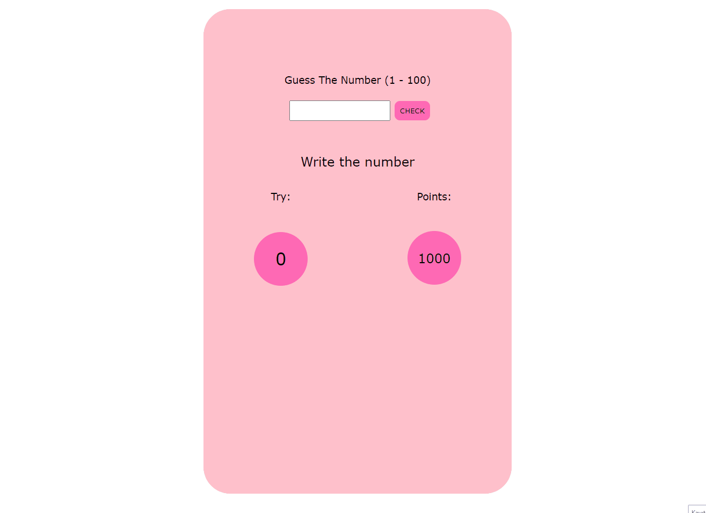

# Guess-The-Number
<h3>visit: https://aokmen.github.io/Guess-The-Number</h3>

---
## Description:

In this project, there are main functionalities implemented using HTML, CSS, and JavaScript. Let's break down each functionality:
---
Guess The Number Game:
---
* There is an input field where the user can enter a number and a "CHECK" button.
* The user needs to guess a randomly generated number between 1 and 100.
* When the "CHECK" button is clicked, the JavaScript function checkBtn() is called.
* The function compares the user's guess with the randomly generated number and provides feedback to the user.
* The number of attempts and the points are displayed.
* If the user's guess matches the random number, a "Congratulations" message is displayed.
* If the user runs out of points (reaches 0 points), a "Sorry, you lost" message is displayed.
